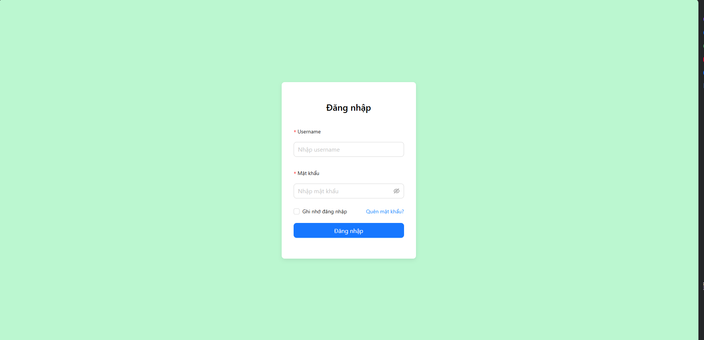
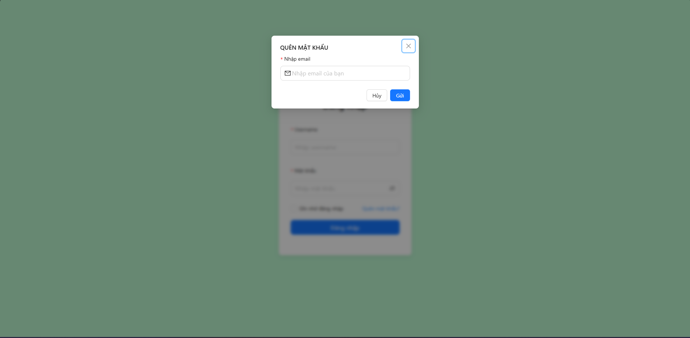
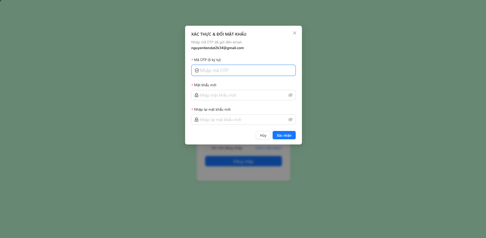
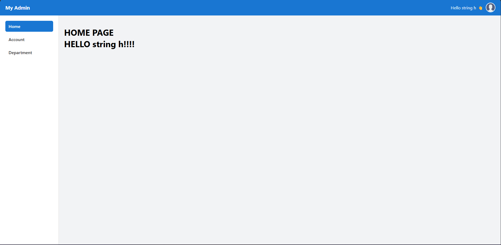
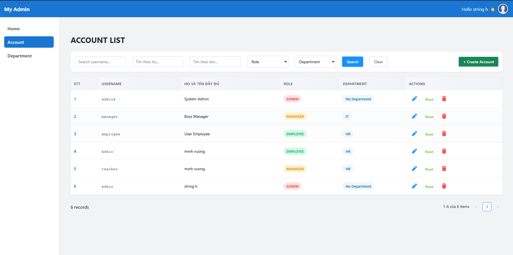
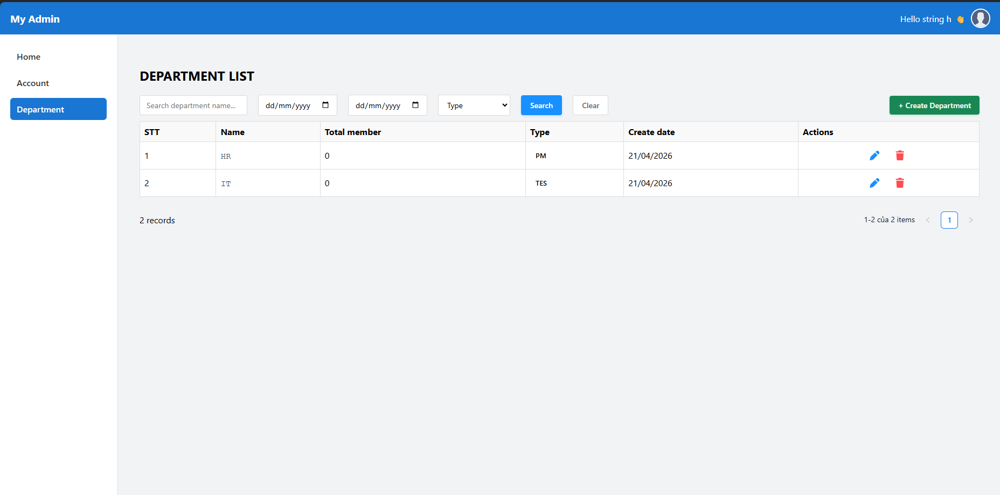
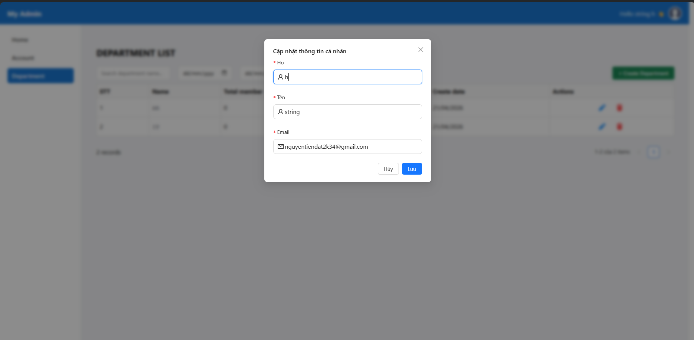
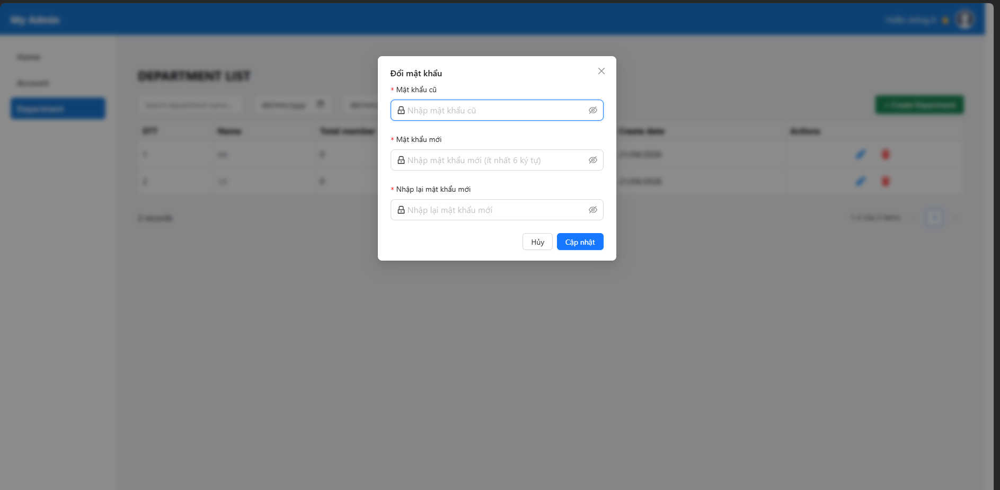
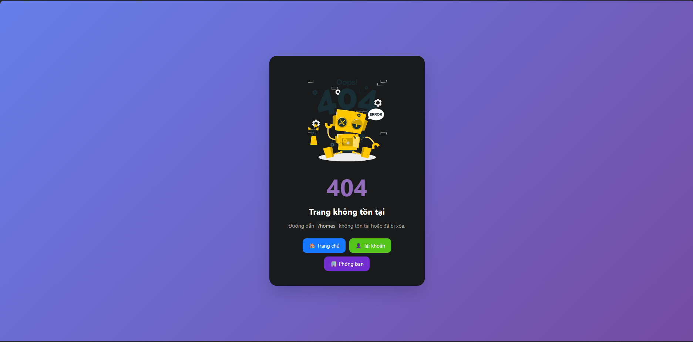

# User Management System

## Overview
User Management System - A frontend application for managing user accounts, departments, authentication, and updating user information
## Demo
- **Frontend**: [Live Demo](https://quan-ly-nguoi-dung-frontend-v1.vercel.app)
- **Backend**: http://localhost:8080/api (local development)
## Screenshots
### Login & Authentication

### Forgot Password  

### Verification & Password Reset

### Dashboard & Management

### Account Management

### Department Management

### Modals & Features
**Update Profile Modal**  

 **Change Password Modal**  

**404 Not Found Page** 

## Tech Stack
- ReactJS (Hooks, Context API)
- React Router
- Axios
- Ant Design / Bootstrap
- JWT Authentication

### Thư viện chính
- **Quản lý state**: React Context API.
- **UI**: Ant Design.
- **Routing**: React Router DOM.
- **Gọi API**: Axios.
- **Thông báo:** React Toastify.
- **Icons**: FontAwesome, React Icons.
  
### Core Libraries
- **State Management**: React Context API
- **UI Components**: Ant Design, Bootstrap 5
- **Routing**: React Router DOM
- **API Client**: Axios
- **Notifications**: React Toastify
- **Icons**: FontAwesome, React Icons
- **Build Tool**: Vite

## Key Features
- Authentication & Authorization (JWT)
- Protected Routes (secure pages requiring login)
- Dynamic data rendering from REST API
- Reusable components (Table, Modal, Form)
- Pagination & Filtering
- User management (CRUD, pagination, filter by role/department)
- Department management (CRUD)
- Automatic token refresh (maintains user session)

## My Contributions
- Built a reusable UI layout (Header, Sidebar).
- Implemented authentication system using Context API.
- Integrated RESTful APIs using Axios.
- Managed routing and protected routes (Protected Routes).
- Implemented automatic token refresh (silent refresh) to maintain user session.
## Quick Setup
1. Clone repo and `cd` into project
2. `npm install`
3. `npm run dev` (runs on http://localhost:5173)
4. Backend required at http://localhost:8080/api

